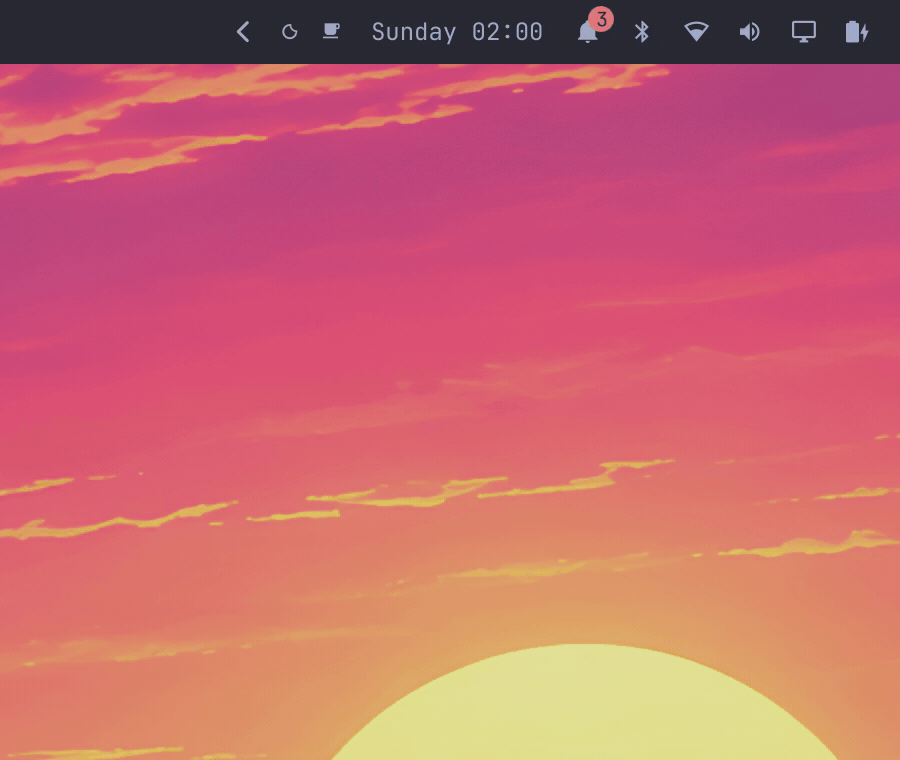
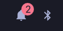
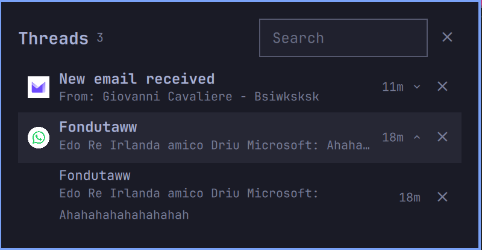
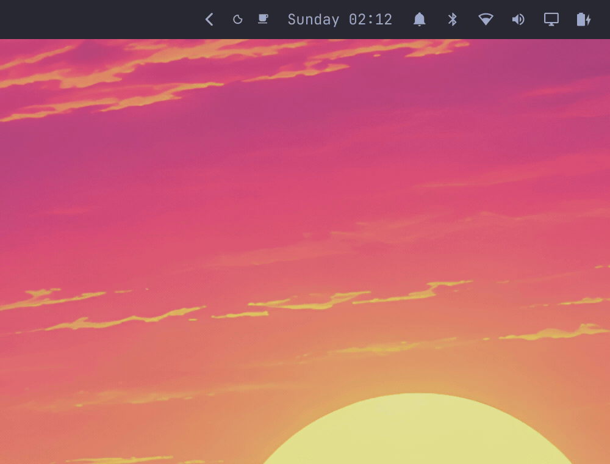

# Threads

An Omarchy notification center that groups by **conversation**, not by app.
Each WhatsApp group, Slack channel or Signal thread gets its own row — because
this plugin does not read Omarchy's notification files at all. It watches the
session bus and sees the full `Notify` payload, hints included.



## Why this exists

Omarchy's stock pipeline (`omarchy.notifications`) strips every hint except
`omarchy-glyph` / `omarchy-exec` before anything downstream sees a
notification. By the time a history file or a toast exists there is no
`x-dunst-stack-tag`, no `x-kde-eventId`, no `desktop-entry` — so no consumer
of the stock service can tell two WhatsApp groups apart. Every existing center
groups at app level at best.

Threads is a **passive session-bus observer**: it never owns
`org.freedesktop.Notifications`, never talks to the daemon, and runs harmlessly
beside the stock service (or any other daemon). It sees every notification,
including DND-silenced ones, and archives the full payload.

## Features

- **True conversation grouping.** Thread key priority:
  1. `x-dunst-stack-tag` / `x-kde-eventId` (per-conversation hints)
  2. `<app> + <summary>` (chat apps put the conversation name in the summary)
  3. app only
- **Browse, don't replay.** A real panel lists threads and entries; history is
  never re-shown as fake toasts.
- **Permanent delete.** `x` removes the cursor entry, or the whole conversation
  when the cursor is on a thread header. Nothing re-reads the pipeline, so a
  dismissed thread never comes back. `c` clears everything.
- **Search** across thread labels, apps and message bodies.
- **Unread badge** on the bar icon, persisted read watermark.
- **Click-through.** Activating an entry invokes the sender's still-live
  `default` action, so a Chromium web app jumps back to the conversation.
  Falls back to the archived link, then to focusing the sending app.
- **DND-independent:** silenced notifications are still captured and archived.
- **Survives restarts:** the archive is plain JSON on disk, pruned to 30 days /
  2000 entries.
- Full keyboard driving, mouse optional.

## Requirements

- **Omarchy 4** — the Quickshell shell; Threads is a bar widget
  (`cad0p.thread-center`).
- **omapager, recommended** — with
  [`njpatel.omapager`](https://github.com/cad0p/omapager) running, entries
  can fire the sender's live action. Everything else works beside the stock
  `omarchy.notifications` daemon too; without a live toast, activation falls
  back to the archived link or focuses the sending app. Until the fixes land
  upstream, install [the fork's `integration` branch](https://github.com/cad0p/omapager/tree/integration)
  (live-action invoke, retained actions, web icons, and Tab navigation are all
  in [open PRs](https://github.com/ryanrhughes/omapager/pulls)).

## Install

```bash
omarchy plugin add https://github.com/cad0p/omarchy-threads --enable
omarchy bar plugin move cad0p.thread-center --section right   # optional
```

For local development, symlink the checkout into the plugin directory:

```bash
ln -sfn "$PWD" ~/.config/omarchy/plugins/cad0p.thread-center
omarchy plugin validate .
omarchy plugin enable cad0p.thread-center
omarchy restart shell
```

### omapager (recommended)

While the deep-link work is in upstream PRs, use the fork's `integration`
branch:

```bash
omarchy plugin add https://github.com/cad0p/omapager.git --enable
git -C ~/.config/omarchy/plugins/njpatel.omapager checkout integration
omarchy restart shell
```

## Usage

Toggle the panel from the bar bell, or from a keybinding of your own:

```bash
omarchy-shell shell toggle cad0p.thread-center
```

The bell carries the unread count:



A conversation, expanded:



### Keys

| Key | Action |
| --- | --- |
| `j` / `k`, arrows | move the cursor across thread headers and expanded entries |
| `enter` / `space` | expand or collapse a thread, or activate the entry under the cursor |
| `x` | permanently delete the cursor entry (or the whole thread if on its header) |
| `c` | clear the whole archive |
| `/` | focus search (`esc` in the field clears and returns) |
| `r` | reload the archive from disk |
| `esc` | close the panel |

Mouse works too: click a thread header to expand it, click an entry to activate
it, and the `×` buttons delete one entry or a whole conversation.

Activating an entry fires the sender's live `default` action while the toast is
still up — for a Chromium web app that is the jump back to the conversation.
Threads itself opens nothing:



## How it works

```
bin/thread-watch   busctl monitor -> one JSON event per line
bin/thread-store   atomic, flock-serialized JSON archive
ThreadLogic.js     pure JS: thread keys, grouping, search, formatting
Panel.qml          bar button + popup panel + IPC
```

- `thread-watch` monitors two `busctl` matches in one process: `Notify`
  method calls and the daemon's method returns. Notify events carry the full
  hint table; the paired return backfills the daemon-assigned id keyed by
  `(sender, cookie)` — D-Bus cookies are per-connection counters, so every
  fresh `notify-send` starts at cookie 9 and cookie-only pairing would patch
  the wrong entries.
- `thread-store` is mechanical: `load`, `meta`, `upsert`, `set-id`, `remove`,
  `remove-thread`, `clear`, `mark-read`, `prune`, `count`. Writes go through a
  temp file + `mv` under an `flock`.
- `ThreadLogic.js` is node-testable; the shell's QML imports the same file.
- `Panel.qml` is the bar button, popup and IPC. Activating an entry asks the
  daemon for the sender's live `default` action (`omapager invoke <id>
  default`); when the toast is gone it opens the archived link, then focuses
  the sending app.

State lives in `$XDG_STATE_HOME/omarchy/thread-center/`:

```
archive.json   newest-first JSON array of notification entries
state.json     { readMark, clearedAt }
icons/         one durable icon per notification source host
```

## Configuration

- `fallbackGrouping: "summary" | "app"` — used when a notification carries no
  conversation hint. `summary` (default) treats the summary as the
  conversation; `app` collapses everything from one app into one thread.
- `THREAD_KEEP_DAYS` (default 30) and `THREAD_MAX_ENTRIES` (default 2000)
  override retention for `thread-store`.

## Tests

```bash
node tests/threadlogic.test.js      # pure logic
bash tests/store-test.sh            # archive behavior against a temp XDG_STATE_HOME
bin/thread-watch --parse < lines    # parse busctl --json=short lines from stdin
```

## Limitations

- The live action needs a still-live toast: the sender's action object exists
  only while the notification is live. Once it is gone, activation falls back
  to the archived link, then to focusing the sending app.
- Per-host icons resolve from installed web apps: a host such as
  `web.whatsapp.com` gets its icon from an installed web app (`--app-id=`
  desktop entry) when one exists; otherwise the row shows the generic bell.
- Notifications are captured with their full payload, which can include
  message text — the archive is plain JSON under your state directory.
- Threads does not act on arbitrary notification buttons; only the sender's
  `default` action is invoked.

## License

MIT — see [LICENSE](LICENSE).
